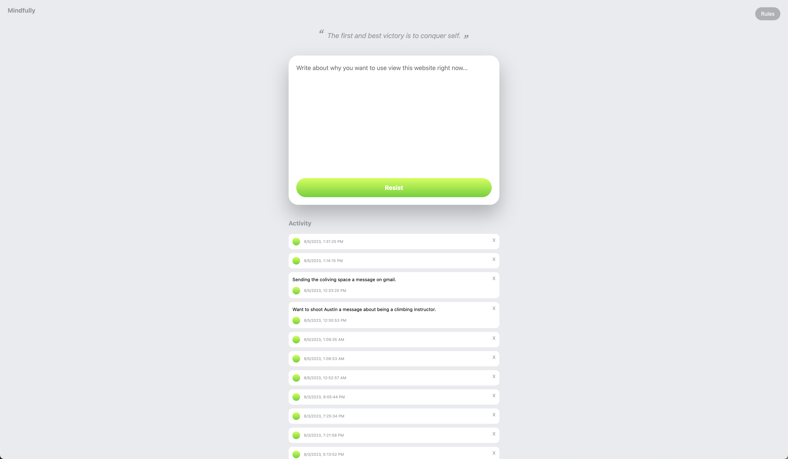
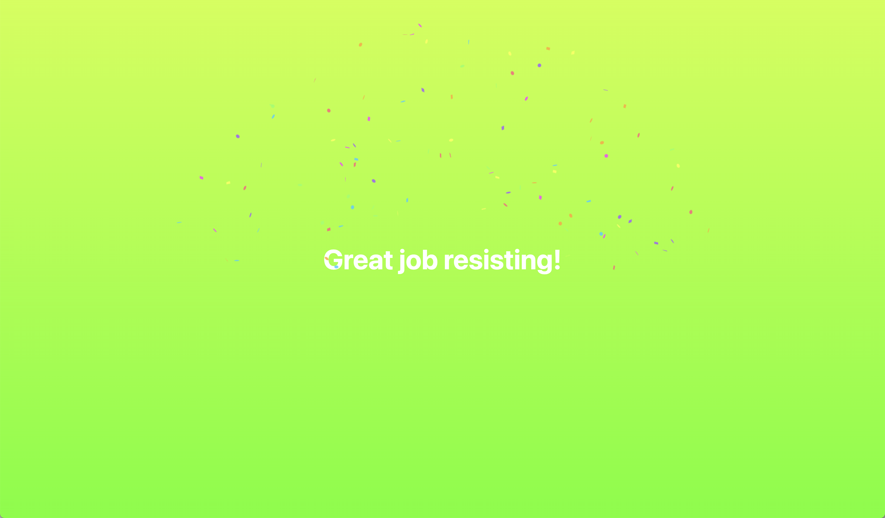
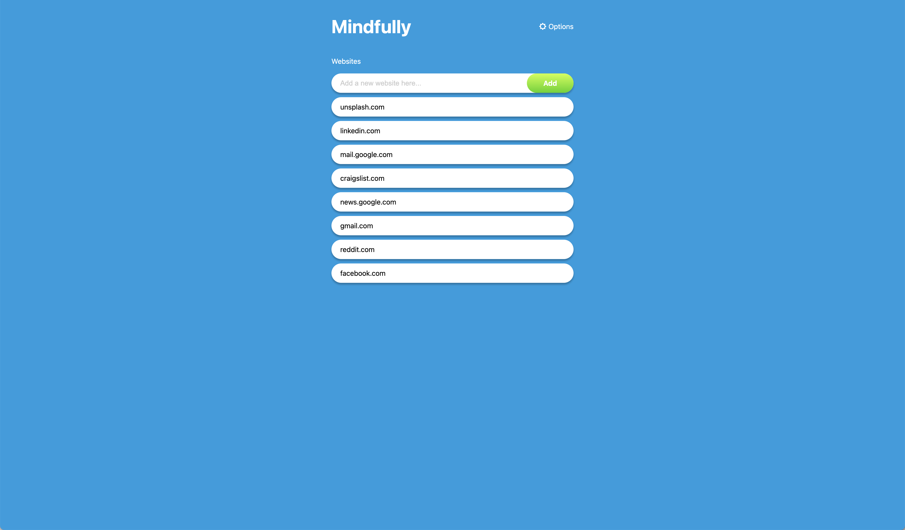

# 🧠 Mindfully

> Be mindful about your web usage

## Features

|           Mindfulness Page           |
| :----------------------------------: |
|     |
|          Resist Award Page           |
|  |
|            Rule Matching             |
|      |

## Setup

1. `npm install`
2. `npm watch` to rebuild Javascript/Typescript into dist directory
3. Load unpacked extension in `chrome://extensions`
4. When some files change, you may need to do a manual reload in the chrome extensions UI
