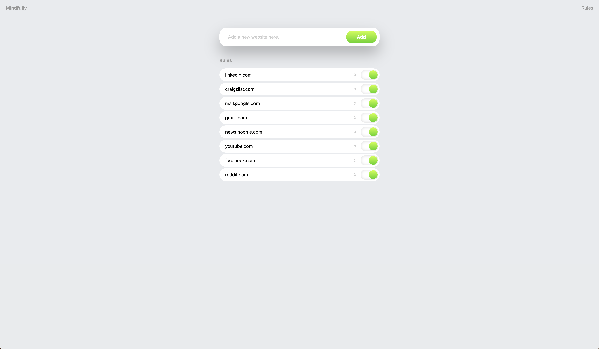

# 🧠 Mindfully

> Be mindful about your web usage

## Features

|           Mindfulness Page           |
| :----------------------------------: |
|     |
|          Resist Award Page           |
|  |
|            Rule Matching             |
|      |

## Setup

1. `npm install`
2. `npm watch` to rebuild Javascript/Typescript into dist directory
3. Load unpacked extension in `chrome://extensions`
4. When some files change, you may need to do a manual reload in the chrome extensions UI

## Todo

- [ ] Error boundary to show errors
- [ ] Swap rule matcher to not use dynamic rules (instead inject and read?)
  - Is this allowed in Manifest v3?
- [ ] Fix packaging step. We're not copying the manifest over and minifying correctly. We're referencing `dist/` in our manifest
- [ ] Add mock setup for dev
- [ ] We may be able to get rid of the background storage worker once we migrate over from dynamic rules
- [ ] Tree shaking isn't happening. Update webpack config to make sure it is. Look at ruleCheck dist w/ navigation.ts
- [ ] Send message to service worker from content script to redirect to page w/ URL

## Context

In Blocky, we're injecting through content_scripts and here we're redirecting to HTML through a dynamic rule redirect.

## Changes

Actually, we should inject a script on page load that checks the URL of the page. If the URL matches a rule, then we redirect to the extensions page.
