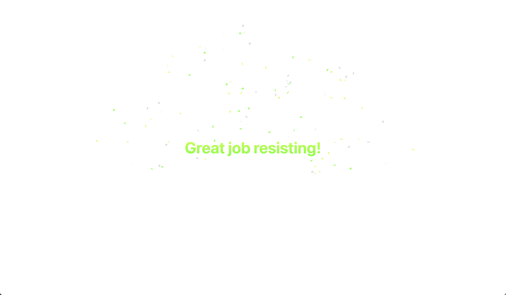

# 🧠 Mindfully

> Be mindful about your web usage

## Features

|           Mindfulness Page           | Rule Disable Allowed After Countdown |
| :----------------------------------: | :----------------------------------: |
|     |  |
|          Resist Award Page           |       Random Background Images       |
|  |  |
|            Rule Matching             |
|      |

## Setup

1. `npm install`
2. `npm watch` to rebuild Javascript/Typescript into dist directory
3. Load unpacked extension in `chrome://extensions`
4. When some files change, you may need to do a manual reload in the chrome extensions UI

## Todo

- [ ] Add rule deletion
- [ ] Fix reloading plugin not picking up dynamically stored rules
- [ ] Add Storybook to display pages
- [ ] Migrate all files to TS
- [ ] When disabling a rule, make it temporary. Re-add the rule after 5/10 minutes? Make this configurable.
